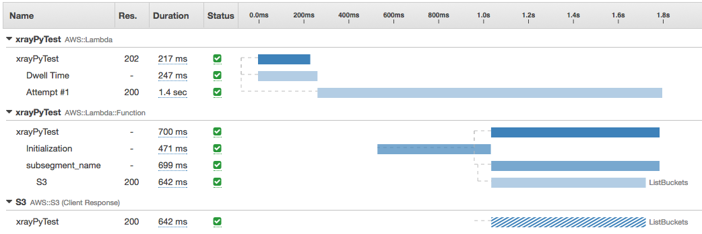
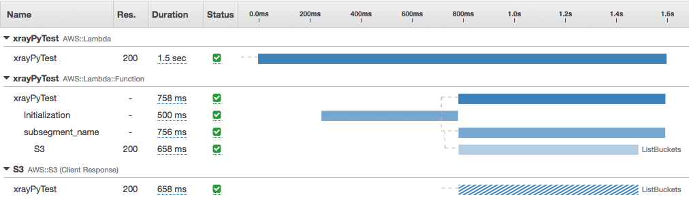

# xrayPyExamplesLambda

AWS  [X-Ray](https://aws.amazon.com/xray/) is a service that helps developers debug, instrument, and performance tune applications.
This example demostrates how to use the AWS [X-Ray SDK] (http://docs.aws.amazon.com/xray/latest/devguide/xray-sdk-python.html) for Python. to instrument a "mock" application.

## Introduction

First, add two directives to your Python source code

```python
from aws_xray_sdk.core import xray_recorder
from aws_xray_sdk.core import patch
```

Second, install the required depedency

```bash
pip install aws-xray-sdk
pip3 install aws-xray-sdk
```

Third, wrap sections of your code in subsegements like this:

```python
subsegment = xray_recorder.begin_subsegment('subsegment_name')

# code here...

xray_recorder.end_subsegment()
```
## Testing

Lambda functions can be invoked either Asynchronously or Synchronously. To invoke your Lambda function in Async specify the --invocation-type flag Event:

```bash
aws lambda invoke --function-name xrayPyTest --invocation-type Event out.txt
```



To invoke your function in Sync, remove the --invoication-type flag, it will default to RequestResponse

```bash
aws lambda invoke --function-name xrayPyTest  out.txt
```



## Resources
